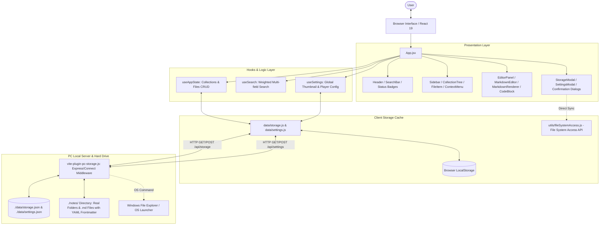

# Architecture & System Design Overview

## 1. Executive Summary
**YouTube Summary** is a specialized, local-first knowledge management web application built with **React 19**, **Vite 8**, and **Tailwind CSS v4**. It allows users to write, organize, and preview Markdown notes organized hierarchically in folders ("collections"), featuring first-class YouTube integration (URL parsing, video ID extraction, interactive thumbnails, inline embedded player) and a dual-layer persistence engine that synchronizes directly to the local PC hard drive (`./notes/` directory as real Markdown files with YAML frontmatter, plus `./data/storage.json`).

---

## 2. Technology Stack & Tooling

| Layer | Technology / Package | Purpose |
| :--- | :--- | :--- |
| **UI Framework** | React 19 (`19.2.8`), React DOM | Reactive UI, concurrent rendering, modern hooks |
| **Build & Dev Server**| Vite (`8.3.0`), `@vitejs/plugin-react` | Ultra-fast HMR and ESM bundling |
| **Styling** | Tailwind CSS v4 (`4.3.3`), `@tailwindcss/typography`, `@tailwindcss/vite` | Modern utility classes and `.prose` markdown styling |
| **Markdown Engine** | `react-markdown` (`10.1.0`), `remark-gfm` (`4.0.1`) | GFM tables, checklists, strikethrough, autolinks |
| **Syntax Highlighting**| `rehype-highlight` (`7.0.2`), `highlight.js` (`11.12.0`) | Syntax highlighting for code blocks (`github-dark` theme) |
| **Code Editor** | `@uiw/react-codemirror` (`4.25.11`), `@codemirror/lang-markdown` | VS Code-style syntax highlighting & line numbers in edit mode |
| **Unique Identifiers**| `uuid` (`14.0.2`) | Cryptographically secure UUIDv4 generation for folders and notes |
| **Linter** | Oxlint (`1.81.0`) | High-speed Rust-based static analyzer |
| **State Management** | Redux Toolkit (`2.12.0`), React-Redux (`9.3.0`) | Centralized predictable state, Immer reducers, and listener middleware |
| **Local PC Backend** | Custom Vite Plugin (`vite-plugin-pc-storage.js`) | Local Node.js file system API (`/api/storage`, `/api/settings`) |
| **Cloud Database & Sync**| Supabase (`@supabase/supabase-js` `^2.99.0`) | PostgreSQL cloud database, background sync & migration service |
| **Client Storage** | Browser `localStorage` + Web File System Access API | Zero-latency startup cache and direct folder synchronization |

---

## 3. High-Level Architecture Diagram



---

## 4. Data Models & Schemas

### 4.1. Collection Model (`Collection`)
Represents a folder node within the recursive collection tree.
```typescript
interface Collection {
  id: string;               // UUIDv4 identifier
  name: string;             // Display name of folder
  children: Collection[];   // Recursive sub-collections (arbitrary depth)
  fileIds: string[];        // Array of MarkdownFile IDs residing in this folder
  createdAt: string;        // ISO 8601 timestamp
  updatedAt: string;        // ISO 8601 timestamp
}
```

### 4.2. File Model (`MarkdownFile`)
Represents an individual Markdown note.
```typescript
interface MarkdownFile {
  id: string;               // UUIDv4 identifier
  name: string;             // File name (e.g. "React Hooks Guide.md")
  content: string;          // Raw Markdown document body
  youtubeUrl: string;       // Attached YouTube link (watch, short, embed)
  youtubeVideoId: string;   // 11-character extracted YouTube video ID
  youtubeTitle: string;     // Video title or custom label
  collectionId: string;     // Parent folder collection UUID
  createdAt: string;        // ISO 8601 timestamp
  updatedAt: string;        // ISO 8601 timestamp
}
```

### 4.3. App State Schema (`AppState`)
The top-level state managed by `useAppState` and persisted to disk:
```typescript
interface AppState {
  collections: Collection[];           // Hierarchical collection tree
  files: Record<string, MarkdownFile>; // Normalized lookup table (id -> file)
}
```

### 4.4. Thumbnail & Player Settings Schema (`ThumbnailSettings`)
Managed by `useSettings` and persisted to both localStorage and `./data/settings.json`:
```typescript
interface ThumbnailSettings {
  quality: 'maxresdefault' | 'hqdefault' | 'mqdefault' | 'default';
  size: 'compact' | 'medium' | 'full';
  aspectRatio: '16/9' | '4/3' | '21/9';
  playbackMode: 'embed' | 'tab' | 'always-embed';
  showBadge: boolean;
  showPlayButton: boolean;
  showTitleBanner: boolean;
  borderRadius: 'rounded-none' | 'rounded-lg' | 'rounded-xl' | 'rounded-2xl';
  hoverZoom: boolean;
  enableAutoplay: boolean;
  showInPreview: boolean;
  shadowEffect: 'shadow-none' | 'shadow-md' | 'shadow-lg' | 'shadow-2xl';
}
```

---

## 5. Storage & Synchronization Architecture

The application adopts a **hybrid local-first synchronization strategy**:

1. **Instant UI Startup via LocalStorage**:
   - `loadStateSync()` hydrates React state immediately upon initial render to prevent UI flickering or layout shifts.
2. **PC File System Sync via Vite Middleware (`vite-plugin-pc-storage.js`)**:
   - Asynchronously queries `/api/storage` on mount. If disk data exists, it updates state and mirrors it back to localStorage.
   - On mutation, state saves are debounced (400ms for files/collections, 300ms for settings).
   - Writes the complete database to `./data/storage.json`.
   - Simultaneously writes out real nested directories under `./notes/` where each note is saved as a valid `.md` file containing YAML frontmatter:
     ```markdown
     ---
     id: "d9e8..."
     name: "React 19 Notes.md"
     youtubeUrl: "https://www.youtube.com/watch?v=..."
     youtubeVideoId: "..."
     youtubeTitle: "..."
     createdAt: "2026-09-17T..."
     updatedAt: "2026-09-17T..."
     ---

     # React 19 Notes
     ...
     ```
   - Automatically cleans orphaned files and directories in `./notes/` that were deleted in the UI.
3. **Web File System Access API Fallback**:
   - In `StorageModal`, users can select any custom directory on their computer using native browser directory pickers (`showDirectoryPicker`) for manual backup and folder synchronization.

---

## 6. Redux Toolkit State Architecture

The application state is managed centrally using **Redux Toolkit (`@reduxjs/toolkit`)**:

1. **Store Slices**:
   - **`notesSlice`**: Manages the collections folder tree, normalized files dictionary, active `selectedFileId`, and PC `storageStatus`. Employs Immer for safe in-place mutations without deep cloning.
   - **`settingsSlice`**: Manages video thumbnail, player interaction modes, and visual badges.
   - **`uiSlice`**: Controls application view routing (`editor` vs `settings`), desktop and mobile sidebar states, modal overlays, and global search state.
2. **Persistence Listener Middleware**:
   - Uses Redux Toolkit's `createListenerMiddleware` to observe mutating actions across `notes` and `settings` slices.
   - Automatically and asynchronously debounces disk writes (`saveState` to `/api/storage` and `saveSettings` to `/api/settings`) without cluttering component UI code.
3. **Memoized Selectors**:
   - Uses `createSelector` in `src/store/hooks.js` for memoized lookups of `selectedFile` and full-text `searchResults`.

